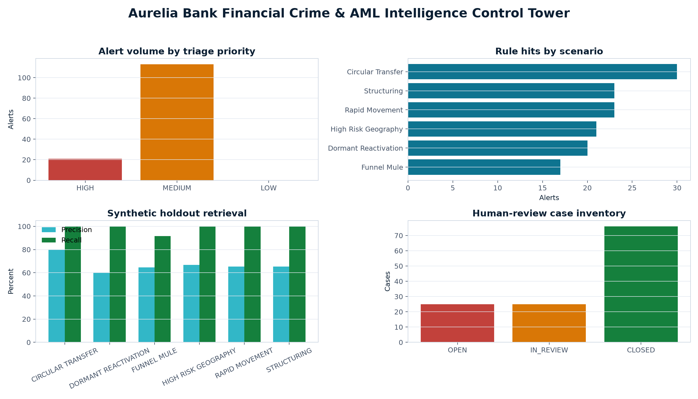
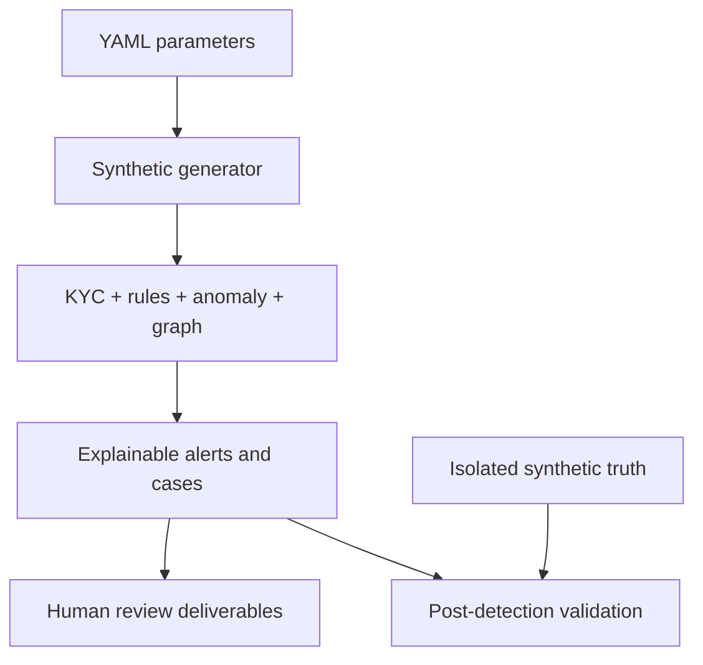

# Aurelia Bank Financial Crime & AML Intelligence Control Tower

[](https://github.com/muratmiracg-dev/aurelia-bank-financial-crime-aml-intelligence-control-tower/actions/workflows/ci.yml)
[](https://github.com/muratmiracg-dev/aurelia-bank-financial-crime-aml-intelligence-control-tower/actions/workflows/codeql.yml)
[](tests)
[](docs/validation_report.md)
[](pyproject.toml)
[](LICENSE)

**A production-style, human-governed AML decision-support platform for KYC risk, transaction monitoring, behavioural anomaly detection, graph intelligence, alert triage and case operations.**

[Executive deck](presentation/Aurelia_Bank_AML_Executive_Deck_EN.pptx) · [Investigation workbook](excel/Aurelia_Bank_AML_Investigation_Workbench.xlsx) · [Executive report](report/Aurelia_Bank_AML_Executive_Report.pdf) · [Methodology](docs/methodology.md) · [Validation](docs/validation_report.md)



## Executive finding

The model and alert operation are controlled, but customer due diligence needs immediate remediation:

- **892 of 1,800 KYC reviews are overdue (49.6%)**, above the **35.0% internal management ceiling**.
- 134 explainable alerts cover 126 customers, a **7.0% customer alert rate** inside the 12.0% ceiling.
- The synthetic holdout produces **67.91% precision, 98.91% recall and 80.53% F1**; lookalike activity creates 43 deliberate false positives.
- 126 cases comprise 76 Closed, 25 In Review and 25 Open; **no active case breaches SLA**.
- All 12 data-quality controls pass; all 21 High-priority alerts retain mandatory human review.

The management response is explicit: clear overdue KYC reviews for alerted and High-risk customers first, fund separate weekly remediation capacity, and preserve the current zero-SLA-breach position.

> **Decision boundary:** Aurelia Bank is fictional. Every customer, account, transaction, relationship and screening flag is controlled synthetic data. Alerts are investigative leads—not findings of criminal activity. The platform cannot submit a ŞİB/STR, restrict a customer or take any adverse action. Numeric scenario settings are internal demonstration parameters, not legal reporting thresholds.

## Why this project exists

Traditional AML demos often stop at a rule or anomaly score. This project implements the wider operating model expected around financial-crime analytics:

- KYC inherent-risk and periodic-review controls;
- transparent transaction-monitoring evidence;
- independent behavioural and network signals;
- explainable alert prioritisation;
- false-positive and false-negative validation;
- human-led case queues, SLA and dispositions;
- model, data, legal and ethical boundaries;
- management-ready Excel, PowerPoint, PDF and Power BI assets.

## Analytical scope

| Module | Implemented analysis | Decision output |
|---|---|---|
| KYC risk | Geography, PEP, synthetic screening, occupation, channel and control gaps | 0–100 score, risk band and reason |
| Structuring | Rolling 48-hour cash clustering below an internal amount parameter | Count, value, source transactions and rationale |
| Rapid movement | Material inflow followed by concentrated outbound value | Outbound ratio and chronology |
| Dormant reactivation | Material activity on a dormant-designated account | Account state and triggering transaction |
| Funnel / mule | Many incoming counterparties followed by concentrated outflow | Fan-in, inflow and outbound ratio |
| Circular transfer | Three-node high-value internal transfer cycle | Cycle members and edge evidence |
| Geography | Material activity with fictitious test jurisdiction `XH` | Country, count and aggregate value |
| Behaviour | Isolation Forest over eight customer-level features | Percentile anomaly and flag |
| Network | NetworkX degree, PageRank, component and short-cycle features | Explainable graph-risk context |
| Triage | Weighted rule, KYC, anomaly and graph signals | Alert score, priority, reason and action |
| Case operations | Customer-level aggregation, queue, SLA and disposition | Human-review workload and evidence packet |
| Validation | Isolated synthetic truth and unlabeled lookalikes | Precision, recall, F1, FP and FN |

## Verified snapshot

Seed `20260821`, cutoff `2026-08-20`.

| Metric | Result | Internal reference | Status |
|---|---:|---:|---|
| Customers | 1,800 | Configured population | Reconciled |
| Accounts | 2,250 | Configured population | Reconciled |
| Transactions | 48,412 | Baseline plus controlled injections | Reconciled |
| Transaction value | TRY 416.6m | Synthetic | Observed |
| High KYC risk | 29 | Internal band | Observed |
| KYC overdue rate | 49.6% | Maximum 35.0% | **Breach** |
| Alerts | 134 | n/a | Observed |
| Customer alert rate | 7.0% | Maximum 12.0% | Pass |
| High-priority alerts | 21 | Human review required | 100% covered |
| Synthetic precision | 67.91% | Reference floor 8.0% | Pass |
| Synthetic recall | 98.91% | Minimum 70.0% | Pass |
| Open / In Review cases | 50 | Weekly capacity 90 | Pass |
| Open SLA breaches | 0 | Zero tolerance | Pass |
| Data-quality controls | 12 / 12 | All pass | Pass |
| Automated tests | 38 | Coverage gate 90% | 96.53% total coverage |

## Architecture and trust boundaries



The validation table is never accepted by a detection function. In the SQL design it resides in a separately permissioned schema.

## Explainable score

For each rule hit:

$$
\text{Alert Score} = 0.60S + 0.16K + 0.14A + 0.10G
$$

where $S$ is scenario severity, $K$ KYC risk, $A$ behavioural anomaly and $G$ graph risk. Every alert exports the component values and a plain-language explanation. High priority starts at 80; Medium at 62. A score affects queue order only.

## Scenario validation

| Scenario | TP | FP | FN | Precision | Recall |
|---|---:|---:|---:|---:|---:|
| Circular transfer | 24 | 6 | 0 | 80.00% | 100.00% |
| Dormant reactivation | 12 | 8 | 0 | 60.00% | 100.00% |
| Funnel / mule | 11 | 6 | 1 | 64.71% | 91.67% |
| High-risk geography | 14 | 7 | 0 | 66.67% | 100.00% |
| Rapid movement | 15 | 8 | 0 | 65.22% | 100.00% |
| Structuring | 15 | 8 | 0 | 65.22% | 100.00% |

These metrics prove retrieval only on the generated population. They are not production-performance claims.

## Deliverables

| Deliverable | Purpose |
|---|---|
| [`excel/Aurelia_Bank_AML_Investigation_Workbench.xlsx`](excel/Aurelia_Bank_AML_Investigation_Workbench.xlsx) | Formula-linked 11-tab investigation and management workbook |
| [`presentation/Aurelia_Bank_AML_Executive_Deck_EN.pptx`](presentation/Aurelia_Bank_AML_Executive_Deck_EN.pptx) | Editable 12-slide executive decision pack with source notes |
| [`report/Aurelia_Bank_AML_Executive_Report.pdf`](report/Aurelia_Bank_AML_Executive_Report.pdf) | Ten-page sourced executive report |
| [`artifacts/aurelia_aml_demo.sqlite`](artifacts/aurelia_aml_demo.sqlite) | Compact governed database with customer, account, alert, case and control layers |
| [`powerbi`](powerbi) | DAX measures, theme and seven-page dashboard specification |
| [`sql`](sql) | PostgreSQL schema, analytical views, investigations and trust boundaries |
| [`neo4j`](neo4j) | Optional Cypher import contract for the exported synthetic graph |
| [`artifacts/figures`](artifacts/figures) | Six reproducible management visuals |
| [`docs`](docs) | Methodology, provenance, model card, validation, playbook and risk register |

Power BI assets are intentionally source-controlled as transparent DAX, theme and implementation specifications. The repository does not claim that an unverified PBIX/PBIP binary has been rendered.

### Reproducible large-file policy

The 48,412-row `data/demo/transactions.csv` and full `artifacts/results/graph_edges.csv` are deterministic generated outputs and are intentionally excluded from source control. `make demo` reconstructs both with seed `20260821`. The committed workbook contains alert-linked transaction evidence, while the compact SQLite file retains the governed customer, account, validation, alert, case and control layers.

## Quick start

Requirements: Python 3.11 or newer.

```bash
python -m venv .venv
source .venv/bin/activate
python -m pip install --upgrade pip
python -m pip install -e ".[dev]"
make verify
```

`make verify` runs Ruff, the 38-test suite with a 90% coverage gate, deterministic regeneration and artifact/checksum verification.

Run individual workflows:

```bash
# Rebuild the complete analytical snapshot
aurelia-aml run --root . --seed 20260821

# Print the current executive summary
aurelia-aml show --root .

# Start the read-only API
make api
```

API examples:

```bash
curl http://localhost:8000/health/ready
curl http://localhost:8000/api/v1/summary
curl "http://localhost:8000/api/v1/alerts?priority=HIGH&limit=20"
curl http://localhost:8000/api/v1/cases
curl http://localhost:8000/api/v1/controls
```

Set `AURELIA_AML_API_KEY` to require the `X-API-Key` header. See [`.env.example`](.env.example).

## Repository structure

```text
.
├── config/                 # Scenario, scoring and operating parameters
├── data/
│   ├── demo/               # Deterministic synthetic source and validation data
│   └── reference/          # Explicit synthetic internal taxonomy
├── src/aurelia_aml/        # Generator, analytics, controls, pipeline, API and CLI
├── tests/                  # Unit, integration, API and governance tests
├── artifacts/              # Results, figures, SQLite database and summary
├── sql/                    # PostgreSQL schema, views and analytical queries
├── neo4j/                  # Optional synthetic graph import contract
├── powerbi/                # DAX, theme and dashboard specification
├── excel/                  # Investigation workbench
├── presentation/           # Executive deck
├── report/                 # Executive PDF report
└── docs/                   # Methodology, validation and governance evidence
```

## Governance documentation

- [Methodology](docs/methodology.md) — formulas, feature logic and decision boundaries.
- [Scenario catalog](docs/scenario_catalog.md) — parameters, evidence and false-positive risks.
- [Data provenance](docs/data_provenance.md) — official, synthetic and derived data separation.
- [Validation report](docs/validation_report.md) — verified metrics, tests and limitations.
- [Model card](docs/model_card.md) — intended use, prohibited use, monitoring and fairness.
- [Investigation playbook](docs/investigation_playbook.md) — human-led review sequence and evidence quality.
- [Risk register](docs/risk_register.md) — model, data, legal, operational and ethical risks.
- [Ethics and human oversight](docs/ethics_and_human_oversight.md) — non-negotiable controls.
- [Architecture](docs/architecture.md) and [data dictionary](docs/data_dictionary.md).

## Primary official references

- [MASAK sectoral suspicious transaction reporting guides](https://masak.hmb.gov.tr/sektorel-sib-rehberleri)
- [MASAK guide update notice, 11 September 2025](https://masak.hmb.gov.tr/duyuru/supheli-islem-bildirim-rehberleri-guncellenmistir-rehberlere-buradan-erisim-saglayabilirsiniz)
- [Law No. 5549](https://masak.hmb.gov.tr/5549-sayili-suc-gelirlerinin-aklanmasinin-onlenmesi-hakkinda-kanun-2)
- [MASAK Measures Regulation](https://masak.hmb.gov.tr/suc-gelirlerinin-aklanmasinin-ve-terorun-finansmaninin-onlenmesine-dair-tedbirler-hakkinda-yonetmelik-3/)
- [FATF Recommendations, updated June 2026](https://www.fatf-gafi.org/en/publications/Fatfrecommendations/Fatf-recommendations.html)
- [FATF risk-based approach for banking](https://www.fatf-gafi.org/en/publications/Fatfrecommendations/Risk-based-approach-banking-sector.html)
- [FATF Recommendation 16 payment-transparency update](https://www.fatf-gafi.org/en/publications/Fatfrecommendations/update-Recommendation-16-payment-transparency-june-2025.html)
- [UN Security Council Consolidated List](https://main.un.org/securitycouncil/en/content/un-sc-consolidated-list)

## Engineering quality

- deterministic synthetic generation and isolated truth labels;
- configuration-driven scenarios, score weights and operating controls;
- typed Python package, CLI and read-only FastAPI service;
- SQLite and PostgreSQL analytical layers;
- 38 automated tests and 96.53% total coverage;
- Ruff formatting and linting;
- GitHub Actions CI and CodeQL;
- Dockerfile with read-only Compose runtime;
- SHA-256 manifest and artifact verification;
- explicit non-production, non-regulatory and human-oversight boundaries.

## License

Released under the [MIT License](LICENSE).

---

Built by **Murat Miraç Gedik** as a Banking, AML, Financial Crime, Risk Analytics and Data portfolio project.
