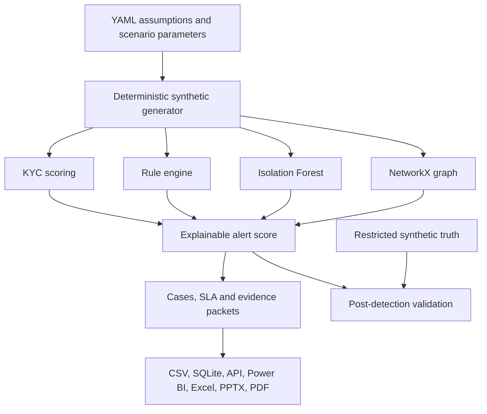

# Architecture and control flow

## Trust boundaries

1. **Configuration:** version-controlled parameters with validation and no secrets.
2. **Synthetic source:** generated bank-like data only; no external identity or screening records.
3. **Detection:** does not import validation truth.
4. **Validation:** compares completed alerts with isolated labels.
5. **Consumption:** read-only API and static management artifacts.
6. **Human decision:** outside the automated system and explicitly required.

## Production extension points

A real implementation would replace CSV inputs with governed lakehouse tables, use a licensed screening service, maintain a temporal entity graph, add event streaming, encrypt data, enforce field- and row-level access, log every case action, implement retention/deletion controls and integrate with a case-management platform. Those capabilities are documented extension points, not claims of this repository.
