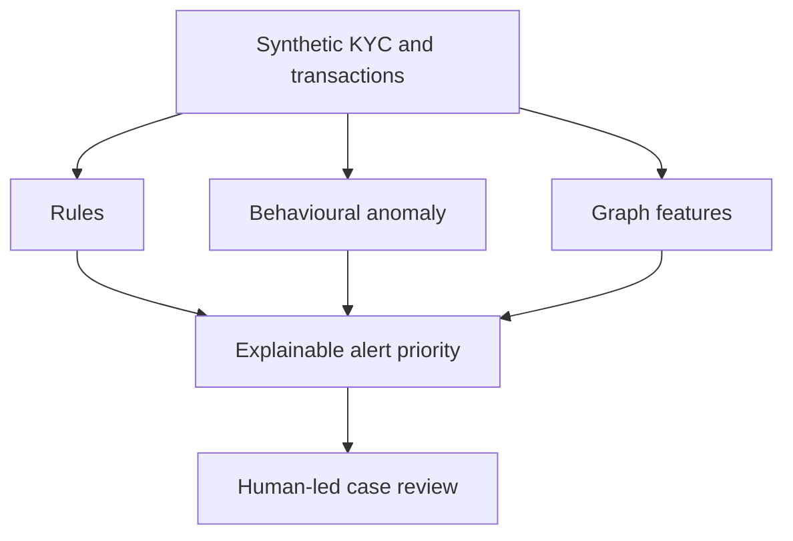

# Methodology

## Purpose and decision boundary

The platform prioritises synthetic investigative leads for a fictional bank. A score is neither evidence of a crime nor a ŞİB/STR decision. The workflow ends at a documented human-review queue; it cannot submit a report, freeze an account or take adverse action.

MASAK's measures framework requires suspicious transactions to be assessed and reported regardless of monetary amount. Consequently, every numeric threshold in this repository is an **internal monitoring parameter**, never a statutory reporting threshold.

## Layered analytical design

The validation-only typology table is physically separate and is introduced only after alerts have been created.

## KYC inherent-risk score

The additive score is capped at 100:

\[
KYC = \min(100, G + P + W + O + C + K)
\]

where `G` is the synthetic jurisdiction risk, `P` the PEP indicator, `W` the synthetic screening placeholder, `O` occupation/industry risk, `C` onboarding-channel risk and `K` KYC control gaps. Bands are Low `<28`, Medium `28–44.99`, and High `>=45`. These boundaries are internal calibration parameters.

## Transaction-monitoring scenarios

Each scenario returns a governed hit with the customer, account, time window, transaction count, aggregate amount, evidence value, internal parameter and up to 20 source transaction identifiers. [Scenario catalog](scenario_catalog.md) records the exact logic.

## Behavioural anomaly score

An Isolation Forest receives eight robust-scaled, customer-level features:

- transaction count and value;
- unique counterparties and maximum transaction;
- turnover deviation against the expected three-month profile;
- cash share, synthetic high-risk jurisdiction share and outbound/inbound ratio.

The model uses 180 estimators, 5% contamination and deterministic seed `20260821`. The decision function is converted to a percentile score from 0 to 100. Anomaly output is a prioritisation signal only; it does not independently create a case.

## Graph analytics

A directed customer–counterparty network aggregates internal transfers. NetworkX calculates in-degree, out-degree, weighted PageRank and undirected component size. High-value, 48-hour subgraphs identify short cycles of three or four nodes. The graph score is:

\[
Graph = 0.35D_p + 0.35P_p + 0.10C_p + 20I_{cycle}
\]

where the first three terms are percentile ranks. A connected component or central node is not suspicious by itself.

## Alert priority

For every rule hit:

\[
Alert = 0.60S + 0.16KYC + 0.14A + 0.10G
\]

where `S` is scenario severity, `A` is anomaly score and `G` is graph score. High priority begins at 80 and Medium at 62. The explanation string exposes every component.

## Case aggregation and SLA

Alerts are grouped by customer. The maximum alert score controls case priority; all involved scenario IDs and alert IDs remain attached. Internal target SLAs are one day for High, three days for Medium and five days for Low. The demo creates a deterministic operational snapshot with Open, In Review and Closed cases. Every case has `human_review_required = true`.

## Validation

Synthetic typologies and unlabeled lookalike activity are injected by the generator. The detection code does not receive those labels. Precision, recall and F1 are calculated at `(scenario_id, customer_id)` level:

\[
Precision = \frac{TP}{TP+FP}, \quad Recall = \frac{TP}{TP+FN}, \quad
F1 = \frac{2PR}{P+R}
\]

This proves retrieval behaviour only on the controlled synthetic population. It is not evidence of effectiveness on production bank data.

## Reproducibility

The pipeline writes versioned CSV outputs, six figures, a SQLite database, an executive JSON summary and SHA-256 manifest. Configuration is externalised in YAML. `make verify` enforces formatting, linting, the test and coverage gate, deterministic regeneration and artifact integrity.
